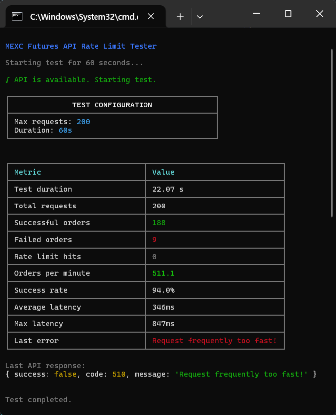
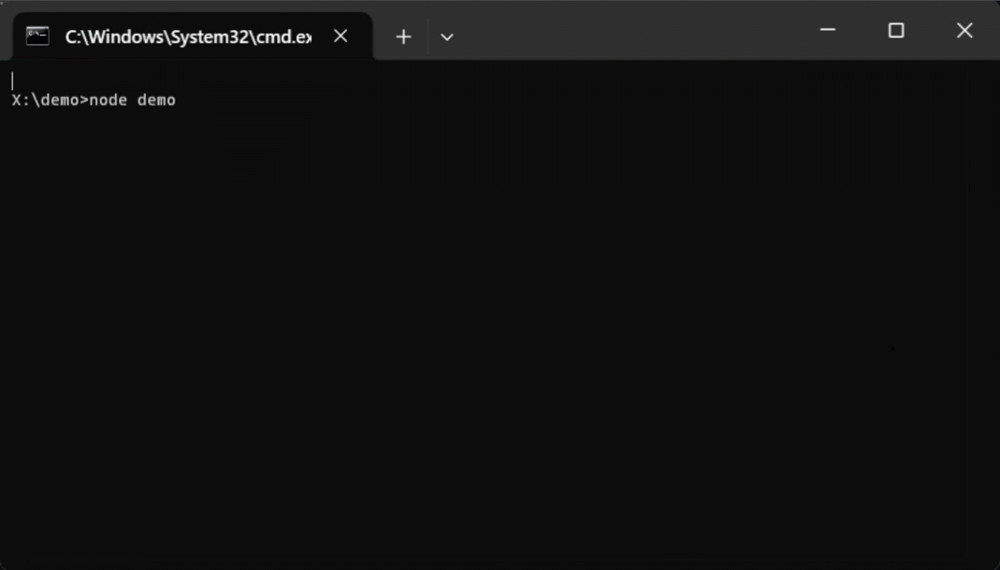

<p align="center">
  
</p>

# Crypto API Automation Toolkit — Professional MEXC SDK

High-performance Python & Node.js toolkit for professional cryptocurrency automation using official MEXC APIs.

**Contact / Purchase:** https://t.me/Goodbye_Chocolate

---

🚀 Introduction

Crypto API Automation Toolkit is a professional solution for traders and developers who want full control over their automation workflow.  
It handles authentication, request signing, rate-limit logic, proxy routing and CLI diagnostics out-of-the-box.

Your GitHub repository is your product page — and this README is your sales pitch.

---

🔥 Key Features

- Automated Trading — place futures & spot orders programmatically  
- Real-Time Market Data — tickers, klines, balances, order books  
- Smart Rate-Limit Handling — auto-retry & backoff  
- Secure Authentication — API key & secret encryption logic  
- Proxy Support — HTTP / SOCKS5 routing  
- Dual Language SDK — Python & Node.js  
- CLI Tools — built-in rate limit stress tester  

---

💻 Supported Platforms

| Environment | Support |
|------------|---------|
| Python | 3.8+ |
| Node.js | 14+ |
| OS | Windows / macOS / Linux |
| Exchange | MEXC Official API |

---

📦 Installation

Python

```bash
pip install crypto-api-automation-toolkit
````

or

```bash
git clone https://github.com/yourrepo/Crypto-API-Automation-Toolkit.git
cd python
pip install -r requirements.txt
```

### Node.js

```bash
npm install @yourorg/crypto-api-automation-toolkit
```

or

```bash
git clone https://github.com/yourrepo/Crypto-API-Automation-Toolkit.git
cd nodejs
npm install
```

---

## ⚙ Configuration (.env)

```
MEXC_API_KEY=your_key
MEXC_API_SECRET=your_secret
IS_TESTNET=false
PROXY_URL=socks5://127.0.0.1:1080
```

---

## 🧠 Usage Examples

### Python

```python
from MexcBypass import MexcBypass
import asyncio

api = MexcBypass("YOUR_API_KEY")

async def main():
    balance = await api.get_balance()
    print(balance)

asyncio.run(main())
```

### Node.js

```js
import { MexcBypass } from "crypto-api-automation-toolkit";

const api = new MexcBypass("YOUR_API_KEY", false);

api.getBalance().then(console.log);
```

---

## 🧪 CLI Rate Limit Tester

<p align="center">
  
</p>

CLI utility benchmarks request limits and safely throttles execution.

```bash
python cli_rate_test.py --duration 60 --max 200
```

---

## 🎥 Live Preview

<p align="center">
  
</p>

<video controls width="80%">
  <source src="demo.mp4" type="video/mp4">
</video>

---

## 💰 Pricing

| Plan                 | Price | Access              |
| -------------------- | ----: | ------------------- |
| Monthly Subscription |   $50 | Private repo access |
| Lifetime Source Code |  $100 | Full source forever |

---

## 🛒 How To Purchase

Contact on Telegram:

**[https://t.me/Goodbye_Chocolate](https://t.me/Goodbye_Chocolate)**

Send your GitHub username — receive private repository invite after payment.

---

## ⚠ Legal Disclaimer

This toolkit works strictly with official MEXC APIs.
Any misuse, market manipulation or ToS violation is strictly forbidden.

Use at your own risk.

---

## ❓ FAQ

**Q:** Refunds?
**A:** All sales are final.

**Q:** Works with other exchanges?
**A:** Modular design allows future adaptation.

---

## 📜 License

© 2025 Crypto API Automation Toolkit — All rights reserved.
Private commercial software.

---

**Telegram Support:** [https://t.me/Goodbye_Chocolate](https://t.me/Goodbye_Chocolate)

```

---

Your GitHub page is now a real commercial product landing.
```
